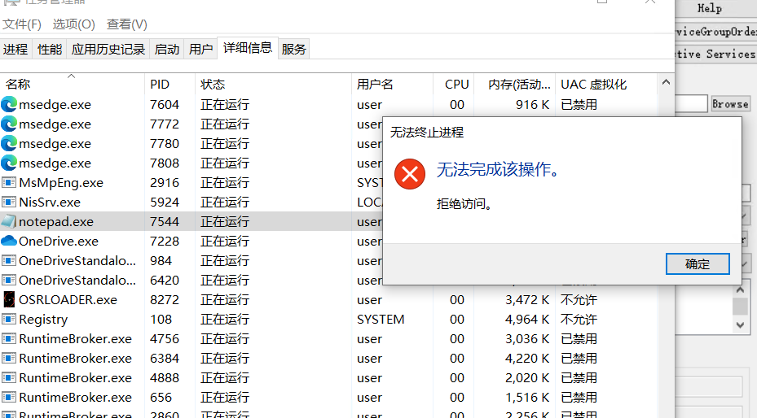

# hvcv
[64位VT基本框架更新中....]

简单的64位VT cpu虚拟化，启用ept，利用EPT Violation实现内核API的inline hook，测试时Hook了NtTerminateProcess，对notepad进程的退出做了监控  
使用尽量简单的语法，以及语言特性，主要是为了学习和理解

测试环境：win10 21h2,win7 7601(虚拟机)   
  
    
    

reference:  

https://rayanfam.com/topics/hypervisor-from-scratch-part-6/  

https://github.com/tandasat/HyperPlatform  

https://github.com/zzhouhe/VT_Learn    

https://github.com/haidragon/newbluepill  

https://github.com/Gbps/gbhv

<<64-ia-32--system-programming-manual-vol-3.pdf>>  

<<处理器虚拟化技术>>

...........   

PS：win10 21H2 物理机测试开启EPT触发KERNEL_SECURITY_CHEKC BSOD，后面也就再没折腾，单纯是出于兴趣，另外，本人并不是写挂的!
